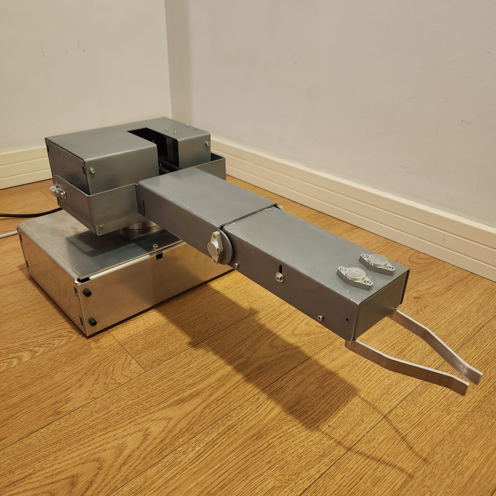
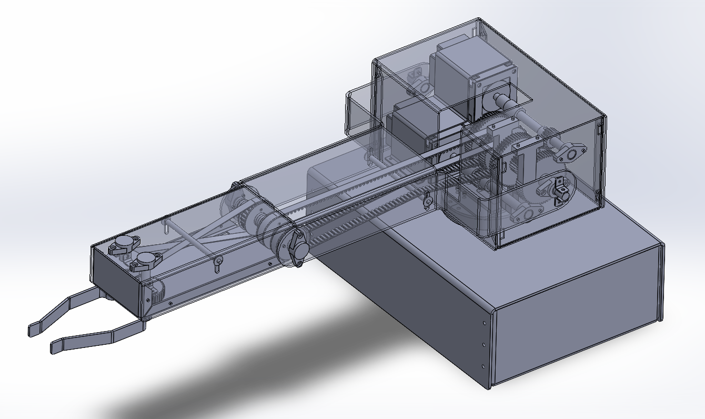
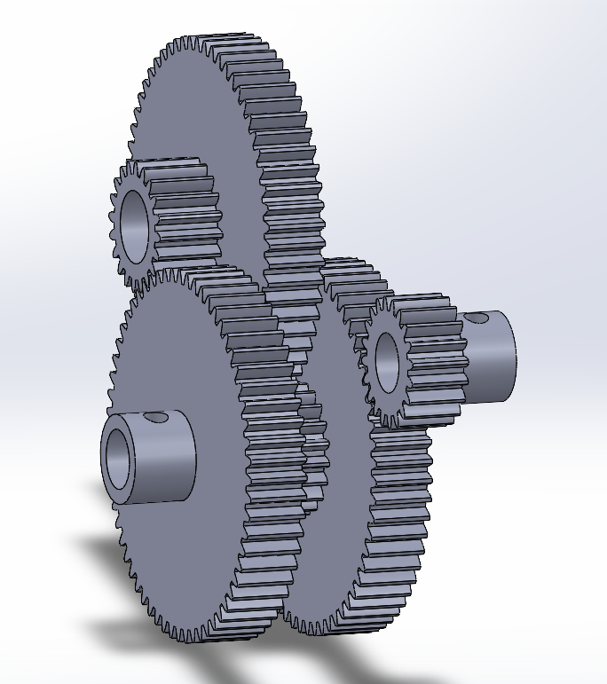
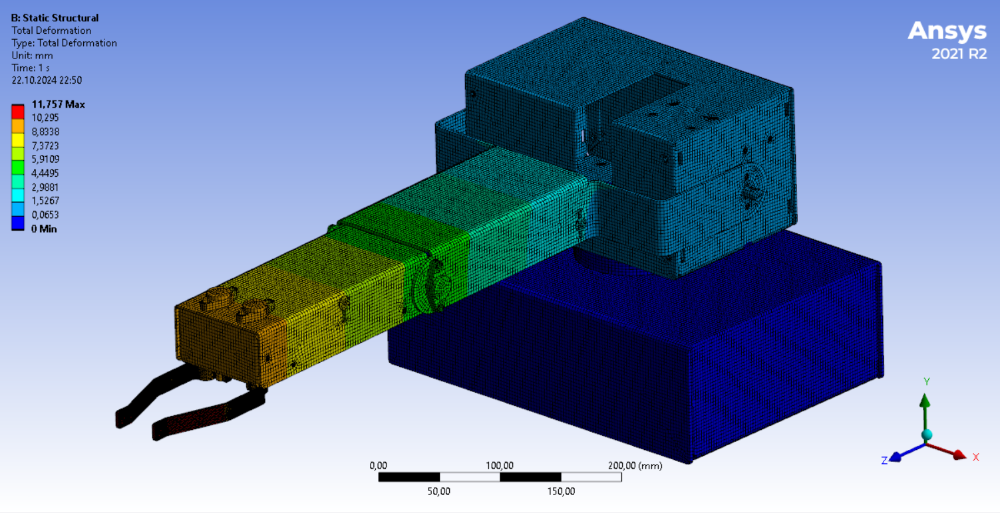
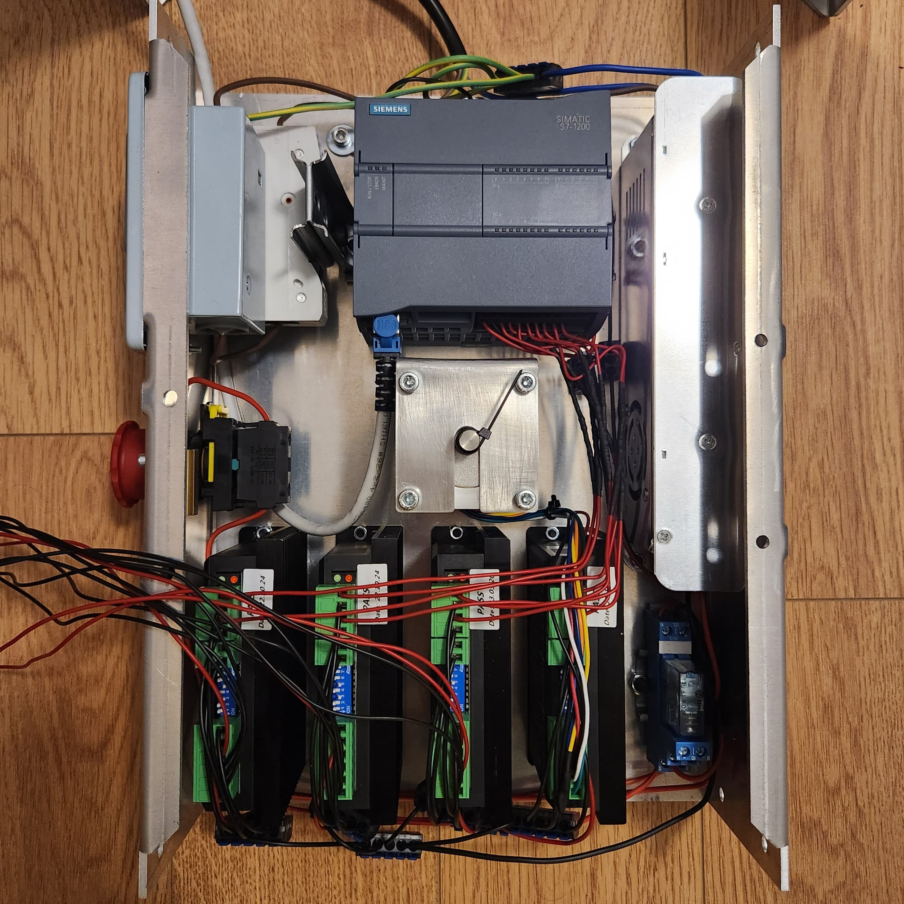
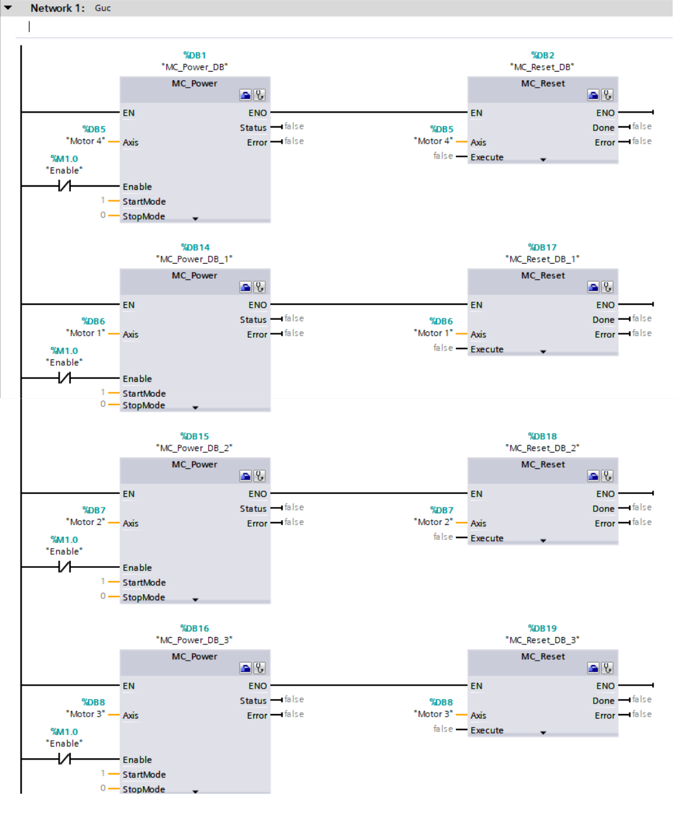
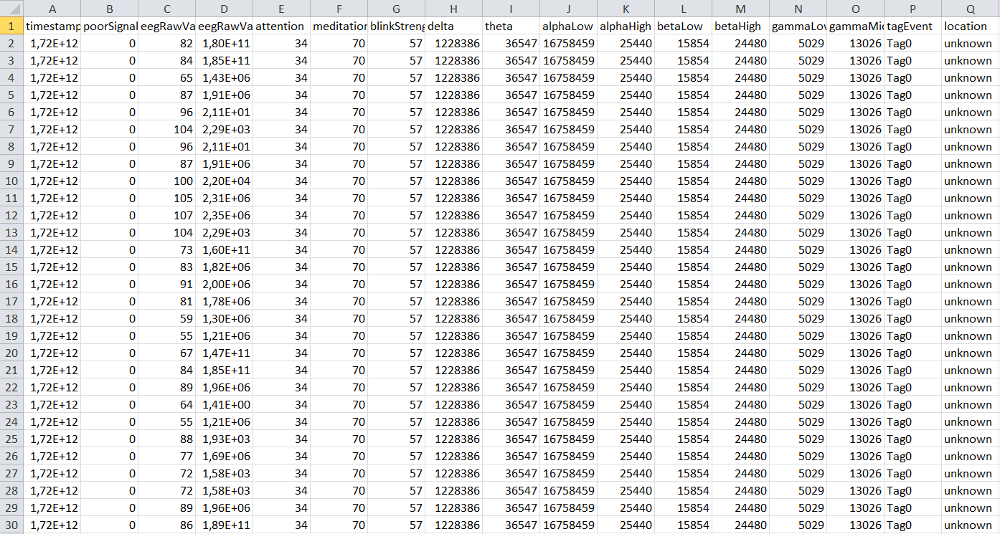
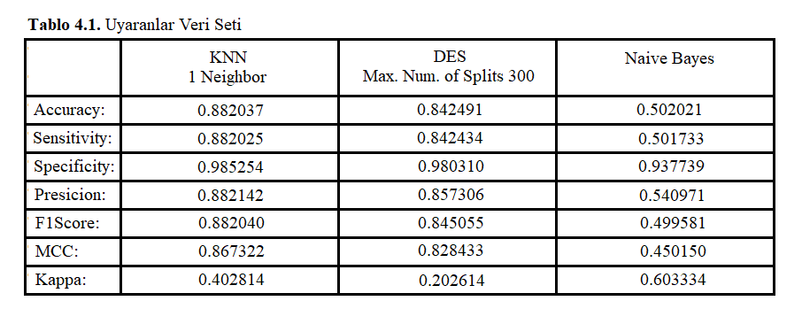

# EEG-Based Control of a 3-Axis Robotic Arm

##  Overview

This repository presents my master’s thesis project on the end-to-end design and development of a 3-axis robotic arm controlled through EEG-based command classification.

The project was developed to explore the feasibility of Brain-Computer Interface (BCI) applications in industrial robotic systems and to build practical experience in full-stack mechatronic system development, including mechanical design, electrical system design, control, signal acquisition, and machine learning.

---

##  Objectives

* Design and build a 3-axis robotic arm from scratch
* Develop a complete mechatronic system integrating mechanical, electrical, and control layers
* Acquire and process EEG signals for command generation
* Classify EEG-based commands using machine learning
* Demonstrate the feasibility of BCI-based control for industrial robotic systems

---

##  System Architecture

The project consists of the following main subsystems:

### 1. Mechanical Design

* Concept design and structural sizing
* Joint torque estimation and motor selection
* Custom transmission and gear design
* CAD modeling and digital assembly in SolidWorks
* Design validation through motion checks and fit verification

### 2. Engineering Analysis

* 2D static torque analysis during early design stage
* Static structural analysis in ANSYS
* Iterative design improvements based on stress and deformation results
* Workspace estimation using MATLAB and Monte Carlo analysis

### 3. Electrical & Electronics System

* Component selection for motors, drivers, relays, power supply, and protection
* Circuit design based on voltage, current, and load requirements
* Panel-level assembly and wiring
* Emergency stop and industrial power considerations

### 4. Control System

* PLC-based motion control with Siemens S7-1200
* Ladder Logic and Function Block programming in TIA Portal
* Parameterized control for speed, direction, and acceleration
* Manual real-time control through WinCC-based HMI

### 5. EEG & Machine Learning

* EEG data acquisition using NeuroSky MindWave Mobile 1
* Dataset generation for multiple robot motion commands
* Signal processing experiments using FFT and Wavelet Transform
* Classification using machine learning methods such as KNN and Decision Tree
* Approximate command classification accuracy of 80%

---

##  Technologies Used

* SolidWorks (CAD design)
* ANSYS (Static Structural Analysis)
* MATLAB (Kinematics, Workspace analysis, ML)
* Siemens TIA Portal (PLC programming)
* WinCC (HMI)
* EEG acquisition (NeuroSky + EEGID)
* Machine Learning (KNN, Decision Tree)

---

##  Mechanical Design

* Full robotic arm designed from scratch in SolidWorks
* Custom gears designed instead of off-the-shelf reducers
* Manufacturing methods used:

  * CNC machining
  * Laser cutting
  * Press bending
* Material selection based on corrosion and mechanical properties
* Lubrication and coating applied for durability

---

##  Engineering Analysis

* Torque calculations for each joint
* Motor selection based on required torque
* Static structural analysis in ANSYS
* Design iteration based on stress & deformation results
* Workspace estimation using Monte Carlo method in MATLAB

---

##  Control System

* PLC-based control using Siemens S7-1200
* Ladder logic and function blocks for multi-axis motion control
* Motor parameters:

  * Speed
  * Direction
  * Acceleration
* HMI interface for real-time manual control

---

##  EEG & Machine Learning

* EEG signals collected for different mental commands:

  * Left / Right (base rotation)
  * Up / Down (arm joints)
  * Gripper open / close
  * Neutral state

* Dataset preparation:

  * CSV formatting
  * Labeling and segmentation

* Signal processing:

  * FFT and Wavelet Transform (evaluated)

* Classification:

  * KNN
  * Decision Tree

* Achieved classification accuracy:

  * ~80%

---

##  Results

* Successfully designed and built a functional robotic arm
* Validated structural feasibility for the target payload through analysis
* Achieved real-time manual control via PLC and HMI
* Demonstrated EEG-based command classification with approximately 80% accuracy
* Showed the feasibility of using BCI-based command interpretation for industrial robotic device control

---

##  Limitations

* Real-time closed-loop EEG-to-robot control was not fully completed within the thesis timeline
* Dataset size was limited
* Noise in EEG signals affected classification performance

---

##  What I Learned

* End-to-end mechatronic system development
* Mechanical design and manufacturing processes
* Industrial control logic development with PLC systems
* Robot kinematics and workspace analysis
* Practical engineering trade-offs across mechanics, electronics, and control
* EEG signal acquisition and preprocessing
* Machine learning basics for classification
* System-level engineering thinking

---

##  Future Work

* Real-time integration of EEG classification output with robot control system
* Larger and cleaner EEG datasets
* Improved signal processing, filtering, and future extraction methods
* Expansion to higher-DoF robotic systems
* Integration with modern robotics software frameworks

---

##  Project Media

###  Robot Arm Overview

###  SolidWorks Assembly

### CAD Gear Train

###  ANSYS FEA Analysis

###  Electrical Control Panel

###  PLC Ladder Logic Control

###  EEG Dataset Preview

###  ML Classification Accuracy Results

###  Robot Arm Control Demo

---

